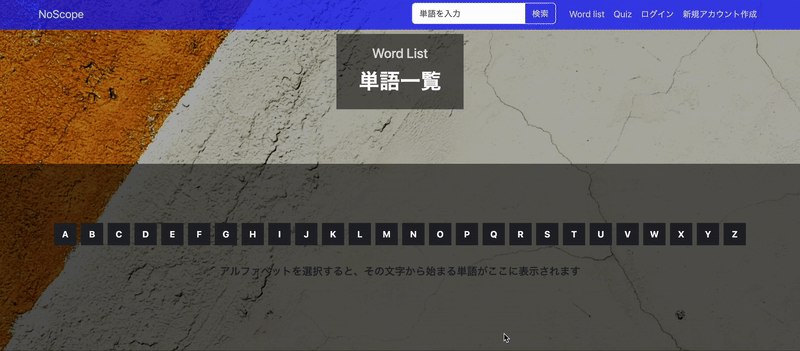
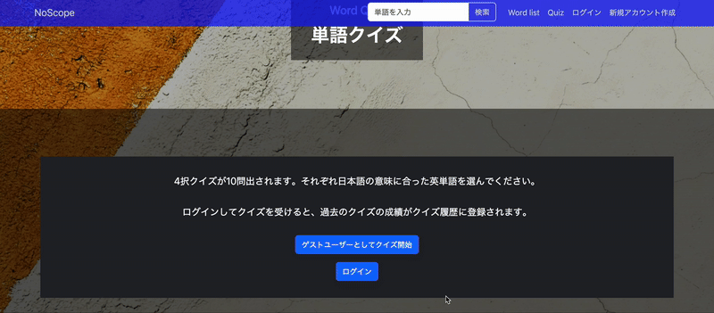
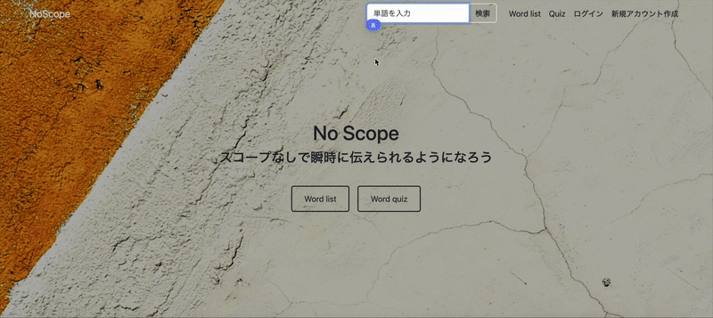
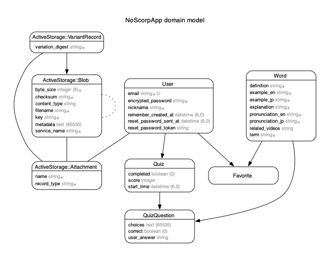

# 🎯 **No Scope**

サイト URL: https://no-scope-7a687b7df71c.herokuapp.com/

## 🌟 **概要**

No Scope はゲーム Counter-Strike の日本人プレイヤーが気軽に海外のプレイヤーともコミュニケーションができるようになる手助けをするアプリです。"No Scope" という名前は、「スコープを覗かずに素早く的を定め撃つテクニックであり、スコープを覗く必要もないくらい素早く英語フレーズが出てくることを目指す」という思いが込められています。

## ✨**機能**

1. **Word List**: Counter-Strike でよく使われる単語のリストを確認
2. **Word Quiz**: 意味が一致する英単語を 4 択の中から選ぶクイズが出題(全10問)
3. **Word Search**: 日本語または英語から単語を検索
4. **Favorite Word list**:アカウントにログインしているユーザーのみが使用可能な「お気に入りの単語リスト」機能
5. **Account**: 一般的なアカウント機能
6. **Guest**: アカウントを作成せずとも、Word Quiz を受けることが可能

## 📖  **主な機能の使い方**

- **Word List**:<br>確認したい英単語をアルファベットのボタンでフィルターし、その意味や詳細を確認できます。



- **Word Quiz**:<br>Counter-Strike の用語を覚えたり、どの程度知っているか確認するための 4 択クイズです。アカウントにログインして受けると過去のクイズ履歴一覧にログが残ります。10 問答え終わると結果が表示されます。



- **Word Search**:<br>サイトのページ上部にある検索バーに入力して関連する単語を検索することができます。検索結果は単語一覧に含まれている単語のみです。



## 💡 **こだわり**

- **関連する動画を表示**:  
実際の単語の使用場面が分かるよう、Youtube API を使用して関連動画を取得できるようにしました

- **他のユーザーのクイズ結果を表示**:  
勉強のモチベーションアップのため、他のユーザーのクイズ結果をホームに表示しました


## 💻 **主な使用技術**
- **フロントエンド**  
HTML / CSS / JavaScript / Bootstrap 5（スタイリング）/ Hotwire（Turbo, Stimulus） — インタラクティブUIの構築に使用

- **バックエンド**  
Ruby 3.1.3 / Ruby on Rails 7.1.3 / MySQL（本番環境：ClearDB、開発環境：SQLite）

- **認証**  
Devise（ユーザー認証）

- **テスト**  
RSpec / Capybara / Selenium（システムテスト・統合テスト）

- **インフラ・開発環境**  
Heroku（デプロイ） / GitHub Actions（ CI/CD パイプライン）/ Git, GitHub（バージョン管理）


## **ER図**



## **以下は自分用メモ**

## 🚀 **Starting the App**

To start the app, use the following command:

```sh
docker-compose up
```

## 📜 **Running Rails Commands (Docker)**

To run Rails commands within the Docker environment, use the following format:

```sh
docker-compose exec <app_name> bundle exec rails <rails_command>
```

Example:

```sh
docker-compose exec web bundle exec rails db:seed
```

> **Note:** The `web` app name comes from the 

docker-compose.yml

 file. There is no need to go inside the container to run these commands.

## 🛠️ **Running Commands (No Docker)**

### **Start the app**

```sh
./bin/rails server 
OR
bundle exec rails server
```

### **Start the database**

```sh
docker-compose up
```

### **Migrate the database**

```sh
bundle exec rails db:migrate
```

### **Seed the database**

```sh
bundle exec rails db:seed
```

### **Compile assets**

```sh
bundle exec rake assets:precompile
```
